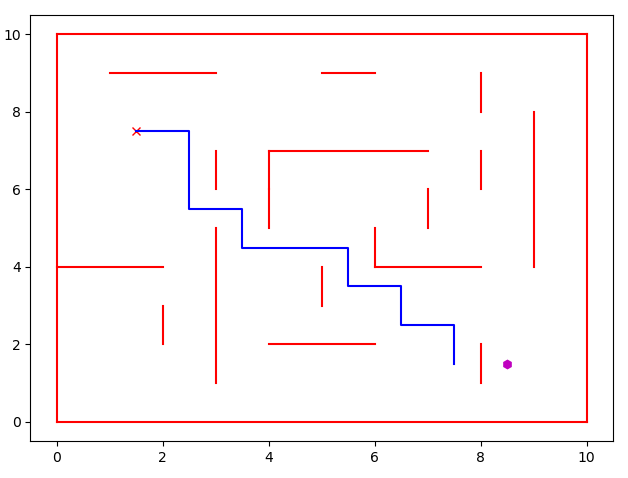
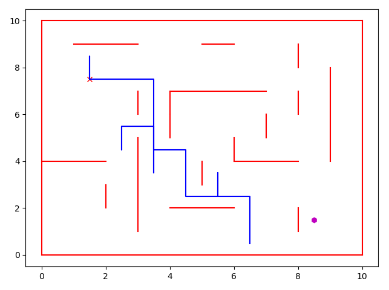
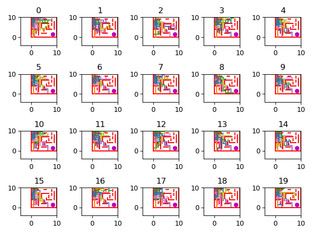

# swarm-intelligence-algorithms
Implemented versions of Particle Swarm Optimization, Ant colony optimization and Artificial Bee Colony Optimization algorithms. 

Created test environment - 2d box with walls like a simple maze. The goal of the swarm algorrithms is to find the best sequance of actions to get to the finish point from start point. 

Move actions codes: [up - 1, down - 2, right - 3, left - 4, stay - 0]. Swarm agents search for the vector of those move codes, which will lead to finish point. 

Swarm algorithms search optimal solution based on a random samples of data, so it might take a lot of epochs to find the best solution.

Image of a path, created by Ants Swarm:

Image of path, created by Particles Swarm:

Image of learning process through epochs

